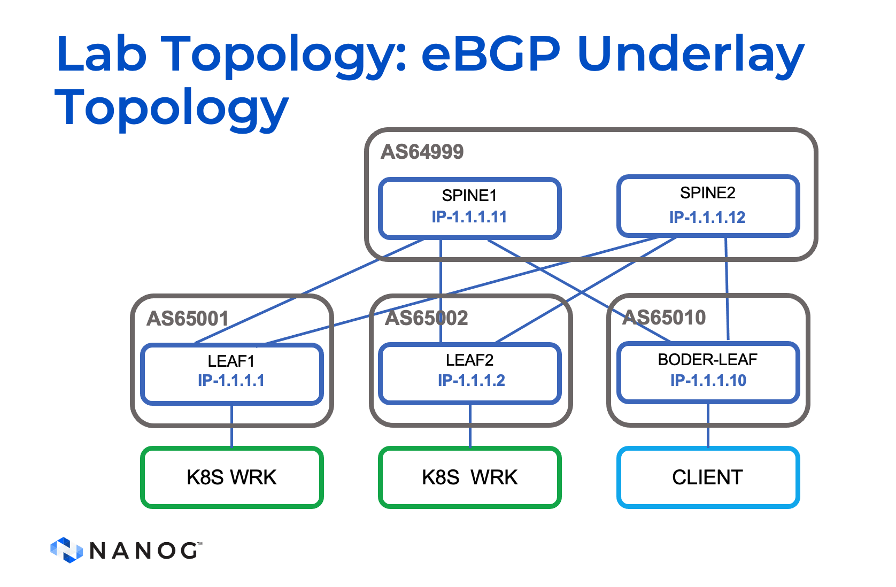
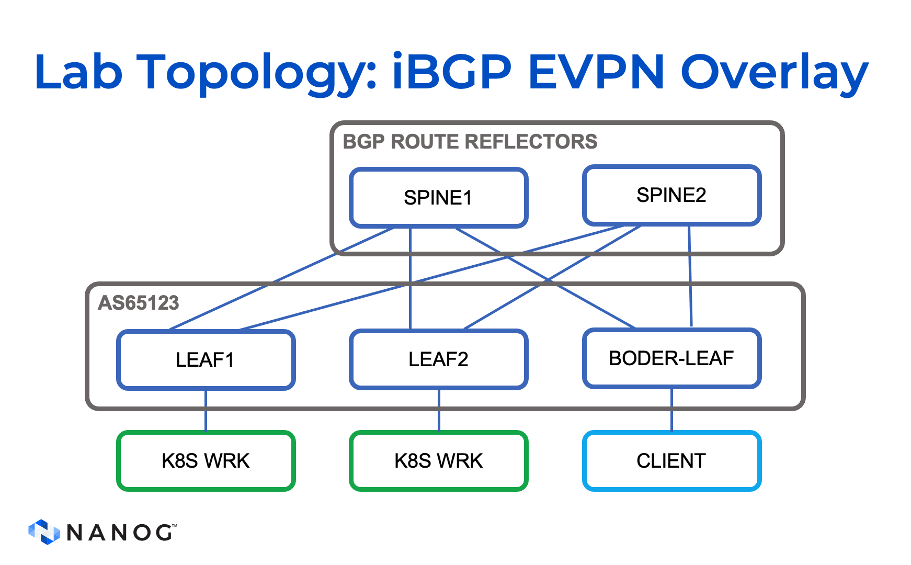
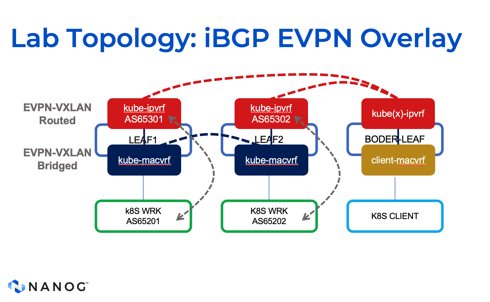
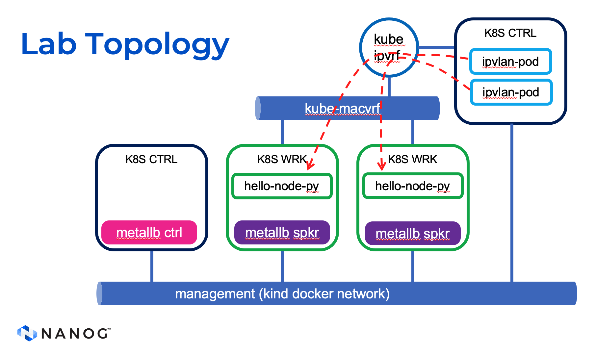

# Kubernetes BGP True Load Balancer for Datacenters

Are you struggling with load balancing in your on-premises Kubernetes cluster? Do you wish to have the same level of automation and experience as the Public Cloud? Look no further! In this presentation, we will guide you through defining your own on-premises Kubernetes LoadBalancer service using BGP through the Datacenter Fabric and bringing true load balancing across the leaf switches with ECMP.

We will demonstrate how to set up a demo from scratch using open-source tools like Containerlab, MetalLB, and Kubernetes Kind. MetalLB is one of the most widely used open-source load balancer projects in enterprises and is suitable for telco use cases like IoT or 5G edge designs. Kubernetes Kind is a tool for running local Kubernetes clusters using Docker container “nodes” and can be used for local development or CI.
This presentation is intended for audiences with any level of skills.

We welcome any collaboration on this project.

Don't miss this opportunity to learn how to bring true load balancing to your on-premises Kubernetes cluster.

## Why should I care? On-Premises Cluster Support
Kubernetes does not provide a built-in implementation for on-premises clusters, which can limit your options for deploying and managing your applications in your local environment. This project aims to address this limitation and enable Kubernetes support for on-premises clusters.

## BGP Mode K8s Load Balancer
The BGP Mode K8s Load Balancer is a powerful solution for load balancing in Kubernetes clusters. It utilizes BGP-based leaf-switches to implement stateless load balancing, providing several benefits:

*<b>Distribution Across the Network</b>: By leveraging BGP, the load balancer brings distribution across the network, ensuring efficient utilization of resources and optimal performance for your applications.

*<b>Resilience and Fast Failover</b>: The BGP Mode Load Balancer offers a resilient solution for handling failures. It incorporates fast failover mechanisms, ensuring minimal downtime and maintaining the availability of your services.

*<b>BFD Support (Experimental)</b>: Although not included in this demo, the load balancer also supports BFD (Bidirectional Forwarding Detection), which enables fast detection of link failures and quicker routing decisions. Please note that BFD support is currently in an experimental stage.

*<b>True Load Balancing via ECMP</b>: With the BGP Mode Load Balancer, you can achieve true load balancing using Equal-Cost Multipath (ECMP) routing. This feature evenly distributes traffic across multiple paths, maximizing the utilization of available network resources.

*<b>Flexible Traffic Control</b>: The load balancer offers two options for traffic control: Cluster and Local. These options allow you to customize how traffic is managed within your Kubernetes cluster, giving you more control over routing and optimizing the performance of your applications.

By utilizing the BGP Mode K8s Load Balancer, you can enhance the capabilities of your Kubernetes clusters, enabling on-premises support and leveraging advanced load balancing features for improved performance, resilience, and control.

## Lab Topology and Configuration

The lab environment utilizes Nokia SR Linux switches. These switches are configured to work in an EVPV-VXLAN (Ethernet Virtual Private Network - Virtual Extensible LAN) setup. This architecture provides a scalable and flexible solution for network virtualization and overlay networking.

### eBGP Underlay for Underlay Communication

The following topology diagram illustrates how eBGP (external Border Gateway Protocol) is used to establish the underlay communication and advertise the different loopback interfaces. eBGP is an interdomain routing protocol that enables the exchange of routing information between different autonomous systems (ASes) in a network.



### Overlay iBGP EVPN-VXLAN Setup

In addition to the underlay settings, the lab incorporates an overlay iBGP (internal Border Gateway Protocol) EVPN-VXLAN setup. This configuration provides efficient and scalable control plane signaling for the virtualized network. With iBGP, the switches within the fabric exchange routing information and maintain a synchronized view of the network.



### VRFs and Subnets for BGP Connectivity

The lab leverages VRFs (Virtual Routing and Forwarding) and subnets to establish BGP (Border Gateway Protocol) connectivity between the Leaf switches and the Kubernetes nodes. VRFs allow for logical separation of the network, enabling different routing domains within the same physical infrastructure.



### Kubernetes Load Balancer Service

To enable connectivity between different workloads, the lab includes a Kubernetes Load Balancer service. The Load Balancer service provides a way to distribute incoming network traffic across multiple instances of a workload for enhanced availability and scalability.

The diagram below provides an abstraction of the view and the connections between the various workloads. The workloads from the client Kubernetes cluster connect directly to the border leaf.




## Installing the lab

To set up this lab environment, you will need to use containerlab and Kind Kubernetes. You can refer to the install.sh file for a list of all the requirements needed on your server. Please note that the install.sh file has been tested with Fedora33.

### Automated option
An automation option is provided for your convenience, although it is still under development (written in Golang). Contributions to this project are welcomed. To use the automation option, follow the syntax below:
```bash
sudo ./srklab -c start srklab.yml
```
Depending on the specific file you choose, you can preload images and install required elements in both Kubernetes clusters.

There is also an alternative file available that only loads the images and allows you to install the elements on your own at a later time. For a better understanding, please refer to the configuration section below:
```bash
sudo ./srklab -c start srklab-nolb.yml
```

#### configuration file format

The configuration file allows you to customize various aspects of the lab setup. Here's how it works:

First, the application will create a Docker network called "kind" to be used by Kind and containerlab. Additionally, you need to specify the prefix and the location of the topology file. See the example below:

```yaml
network: "kind"  #do not change unless you do that in all the files
prefix: "172.18.0.0/16" #do not change unless you do that in all the files
clabTopology: "./topo.yml"  
```

Next, you have a cluster section where you specify the location of the kubeconfig file and the configuration file for the cluster during the Kind Kubernetes setup. In this case, a registry is not defined for the Kind clusters. Instead, the images are preloaded to be used by the different resources installed in the cluster. Each image is specified line by line. Additionally, you provide a list of the apps and resources that you want to install. See the example below:

```yaml
clusters:
    - name: "client"
      kubeconfig: ".kube/config-client"
      config: "./kind/cluster_client.yaml"
      image: "kindest/node:v1.23.17"
      imagesToLoad:
        - image: alpine:latest
        - image: rogerw/cassowary:v0.14.1
        - image: pinrojas/cassowary:0.33
        - image: prom/pushgateway:latest
        - image: ghcr.io/k8snetworkplumbingwg/multus-cni:snapshot  
      resources:
        - app: "./kind/multus-daemonset.yml"
        - app: "./kind/cni-install.yml"
        - app: "./app/ipvlan-cni-client.yaml"
        - app: "./app/ipvlan-pods-client.yaml"
```
Finally, you define the connections to be used by clab tools veth, along with the IP, gateway, and any VLANs that may be required for the interface from the Kubernetes node. This information is used, for example, with a CNI plugin. See the example below:

```yaml
links:
    - k8sNode: "client-control-plane:e1-1"
      clabNode: "clab-dc-k8s-BORDER-DC:e1-10"
      k8sIpv4: "192.168.201.101/24"
      k8sIpv4Gw: "172.18.0.1"  # Multus would required to download files from github
      ipvlanMaster:
        - vlan: 1001
```

### Manual option
Alternatively, you can manually start the lab and connect the Kubernetes instances after with ```clab tools veth``` using the following commands:

```bash
sudo git clone https://github.com/cloud-native-everything/metallb-srl-nanog89/
sudo clab deploy -t topo.yml
```
By following either the automated or manual options, you can set up the lab environment and establish connections between the Kubernetes instances, allowing you to proceed with your desired experiments.